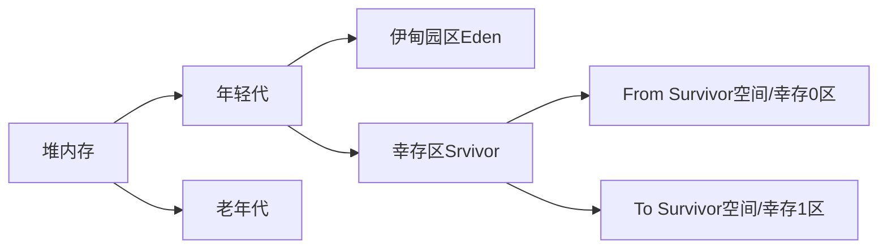

# JVM探究

- 请你谈谈对JVM的理解？java8虚拟机和之前的变化更新？
- 什么是OOM，什么是栈溢出StackOverFlowError？怎么分析？
- JVM的常用调优参数有哪些？
- 内存快照如何抓取，怎么分析Dump文件？
- 谈谈JVM中，类加载器的认识？

[The Java® Virtual Machine Specification (oracle.com)](https://docs.oracle.com/javase/specs/jvms/se8/html/index.html)（官方文档）

[【JVM系列】JVM内存区域（JVM运行时数据区域)_bug师姐的博客-CSDN博客_jvm内存区域](https://blog.csdn.net/zcl_love_wx/article/details/124511124)

[JVM内存区域详解_ITenderL的博客-CSDN博客_jvm内存区域](https://blog.csdn.net/y_eatmeat/article/details/122915625?utm_medium=distribute.wap_relevant.none-task-blog-2~default~baidujs_baidulandingword~default-0-122915625-blog-124511124.wap_blog_relevant_default&spm=1001.2101.3001.4242.1&utm_relevant_index=1)

## JVM的体系结构

## 类加载器

作用：加载Class文件

## 双亲委派机制

1. 类加载器收到类加载的请求。
2. 将这个请求向上委托给父加载器去完成，一直向上委托，直到启动类加载器。
3. 启动类加载器检查是否能够加载当前这个类，能加载就结束，使用当前的加载器，否则抛出异常，通知子加载器进行加载。
4. 重复。

**作用**

1. 防止重复加载同一个`.class`。通过委托去向上面问一问，加载过了，就不用再加载一遍。保证数据安全。
2. 保证核心`.class`不能被篡改。通过委托方式，不会去篡改核心`.clas`，即使篡改也不会去加载，即使加载也不会是同一个`.class`对象了。不同的加载器加载同一个`.class`也不是同一个`Class`对象。这样保证了`Class`执行安全。

## 沙箱安全机制

​	Java安全模型的核心是Java沙箱（sandbox），沙箱是一个限制程序运行的环境。沙箱机制就是将Java代码限定在虚拟机（JVM）特定的运行范围中，并且严格限制代码对本地系统资源访问，通过这样的措施来保证对代码的有效隔离，防止对本地系统造成破坏。沙箱**主要限制系统资源访问**，系统资源包括CPU、内存、文件系统、网络。不同级别的沙箱对这些资源访问的限制也可以不一样。

​	所有的Java程序运行都可以指定沙箱，可以定制安全策略。

​	在Java中将执行程序分为本地代码和远程代码两种，本地代码默认视为可信任的，而远程代码则被看作是不受信的。对于授信的本地代码，可以访问一切本地资源，而对于非授信的远程代码在早期的Java实现中，安全依赖于沙箱（sandbox）机制。

JDK1.0安全模型如下：

​	严格的安全机制给程序的扩展带来了障碍，如用户希望远程代码访问本地系统文件时，就无法实现。因此在后续的Java1.1版本中，针对安全机制做了改进，增加了`安全策略`，允许用户指定代码对本地资源的访问权限。

JDK1.1安全模型如下：

​	在Java1.2版本中，再次改进了安全机制，增加了`代码签名`。不论本地代码或是远程代码，都会按照用户的安全策略设定，由类加载器加载到虚拟机中权限不同的运行空间，来实现差异化代码执行权限控制。

JDK1.2安全模型如下：

​	当前最新的安全机制实现引入了域（Domain）的概念。虚拟机会把所有代码加载到不同的系统域和应用域，系统域部分专门负责与关键资源进行交互，而各个应用域部分则通过系统域的部分代理来对各种需要的资源进行访问。虚拟机中不同的受保护域（Protected Domain），对应不一样的权限（Permission）。存在于不同域中的类文件就有了当前域的全部权限。

最新安全模型（jdk1.6）

## Native

​	使用native关键字说明这个方法是原生函数，也就是这个方法是用C/C++语言实现的，并且被编译成了DLL，由java去调用。
​	这些函数的实现体在DLL中，JDK的源代码中并不包含。对于不同的平台它们也是不同的。这也是java的底层机制，实际上java就是在不同的平台上调用不同的native方法实现对操作系统的访问的。

## PC寄存器

程序计数器：Program Counter Register

​	每个线程都有一个程序计数器，是线程私有的，就是一个指针，指向方法区中的方法字节码（用来存储指向一条指令的地址），在执行引擎读取下一条指令，是一个非常小的内存空间，几乎可以忽略不计。

## 方法区

Method Area方法区

​	方法区是被所有线程共享，所有字段和方法字节码，以及一些特殊的方法，如构造函数，接口代码也在此定义，简单说，所有定义的方法的信息都保存在该区域，**此区域属于共享空间**；

​	**静态变量、常量、类信息（构造方法、接口定义）、运行时的常量池存在方法区中，但是实例变量存在堆内存中，和方法区无关。**

## 栈

先进后出、后进先出

## 三种JVM

+ Sun公司 `HotSpot`
+ BEA `JRockit`
+ IBM `J9 VM`

## 堆

Heap，一个JVM只有一个堆内存，堆内存的大小是可以调节的。

类加载器读取了类文件后，把类、方法、常量、变量放到堆中，保存我们所有引用类型的真实对象。

堆内存中细分为三个区域：

+ 年轻代
+ 老年代
+ 永久代（jdk1.8后为 元空间(Metaspace)，元空间不在堆中）

### 年轻代（YoungGen）

+ 类：诞生和成长的地方，甚至死亡
+ 伊甸园区，所有对象都是在 伊甸园 区new出来的
+ 幸存者区（0区，1区）

### 老年代(OldGen)

### 永久代

这个区域常驻内存，用来存放JDK自身携带的Class对象，存储的是java运行时的一些环境或类信息，这个区域不存在垃圾回收，关闭VM就会释放这个区域的内存。

+ jdk1.6之前：永久代，常量池在方法区
+ jdk1.7：永久代，常量池在堆中
+ jdk1.8之后：无永久代，常量池在元空间

## 堆内存调优

Jprofiler

## GC

垃圾回收

常用算法

+ 标记清除法
+ 标记压缩法
+ 复制算法
+ 引用计数法

## 阅读官方文档

[Chapter 2. The Structure of the Java Virtual Machine (oracle.com)](https://docs.oracle.com/javase/specs/jvms/se8/html/jvms-2.html)

### 2.5运行时数据区

Java虚拟机定义了在程序执行期间使用的各种运行时数据区域。这些数据区域中的一些是在Java虚拟机启动时创建的，并且只有当Java虚拟机退出时才会被销毁。其他数据区域为每个线程。每线程数据区域在创建线程时创建，在线程退出时销毁。

#### 2.5.1.pc寄存器（The pc Register）

Java虚拟机可以同时支持多个执行线程（JLS§17）。每个Java虚拟机线程都有自己的pc（程序计数器）寄存器。在任何时候，每个Java虚拟机线程都在执行单个方法的代码，即该线程的当前方法（§2.6）。如果该方法不是本机的，则pc寄存器包含当前正在执行的Java虚拟机指令的地址。如果线程当前正在执行的方法是本地的，则Java虚拟机的pc寄存器的值是未定义的。Java虚拟机的pc寄存器足够宽，可以在特定平台上保存返回地址或本地指针。

#### 2.5.2.java虚拟机栈（Java Virtual Machine Stacks）

每个Java虚拟机线程都有一个与线程同时创建的私有Java虚拟机栈。Java虚拟机栈存储帧（§2.6）。Java虚拟机栈类似于传统语言（如C）的栈：它保存局部变量和部分结果，并在方法调用和返回中发挥作用。因为除了推送和弹出帧之外，Java虚拟机栈从未被直接操作，所以可以对帧进行堆分配。Java虚拟机栈的内存不需要是连续的。
在Java®虚拟机规范的第一版中，Java虚拟机栈称为Java栈。
该规范允许Java虚拟机栈具有固定大小，或者根据计算需要动态扩展和收缩。如果Java虚拟机栈具有固定大小，则可以在创建该栈时独立地选择每个Java虚拟机栈的大小。
Java虚拟机实现可以为程序员或用户提供对Java虚拟机栈初始大小的控制，以及在动态扩展或收缩Java虚拟机栈的情况下，对最大和最小大小的控制。
以下例外情况与Java虚拟机堆栈相关：
如果线程中的计算需要比允许的更大的Java虚拟机栈，则Java虚拟机将抛出StackOverflowerError。
如果可以动态扩展Java虚拟机堆栈，并且尝试了扩展，但没有足够的内存来实现扩展，或者如果没有足够的可用内存来为新线程创建初始Java虚拟机栈，则Java虚拟机将抛出OutOfMemoryError。

#### 2.5.3.堆（Heap）

Java虚拟机具有在所有Java虚拟机线程之间共享的堆。堆是运行时数据区域，从中为所有类实例和数组分配内存。
堆是在虚拟机启动时创建的。对象的堆存储由自动存储管理系统（称为垃圾收集器）回收；对象从不显式解除分配。Java虚拟机假设没有特定类型的自动存储管理系统，并且可以根据实现者的系统需求来选择存储管理技术。堆可以具有固定大小，或者可以根据计算需要进行扩展，并且如果不需要更大的堆，则可以收缩。堆的内存不需要是连续的。
Java虚拟机实现可以为程序员或用户提供对堆的初始大小的控制，以及如果堆可以动态扩展或收缩，则提供对最大和最小堆大小的控制。
以下异常情况与堆关联：
如果计算需要的堆超过自动存储管理系统的可用堆，Java虚拟机将抛出OutOfMemoryError。

#### 2.5.4.方法区（Method Area）

Java虚拟机具有在所有Java虚拟机线程之间共享的方法区域。方法区域类似于常规语言编译代码的存储区域，或类似于操作系统进程中的“文本”段。它存储每个类的结构，如运行时常量池、字段和方法数据，以及方法和构造函数的代码，包括类和实例初始化以及接口初始化中使用的特殊方法（§2.9）。
方法区域在虚拟机启动时创建。虽然方法区域在逻辑上是堆的一部分，但简单的实现可能选择不进行垃圾收集或压缩。本规范不规定方法区域的位置或用于管理编译代码的策略。方法区域可以具有固定的大小，或者可以根据计算的需要进行扩展，并且如果不需要更大的方法区域，可以进行收缩。方法区域的内存不需要是连续的。
Java虚拟机实现可以向程序员或用户提供对方法区域的初始大小的控制，以及在大小变化的方法区域的情况下，对最大和最小方法区域大小的控制。
以下异常情况与方法区域相关：
如果方法区域中的内存无法满足分配请求，Java虚拟机将抛出OutOfMemoryError。

#### 2.5.5.运行时常量池（Run-Time Constant Pool）

运行时常量池是类文件中常量池表的每类或每界面的运行时表示（§4.4）。它包含几种常量，从编译时已知的数字字面到必须在运行时解决的方法和字段引用。运行时常量池的功能类似于传统编程语言的符号表，尽管它包含的数据范围比典型的符号表要广。

每个运行时常量池都是从 Java 虚拟机的方法区分配的（§2.5.4）。一个类或接口的运行时常量池是在Java虚拟机创建该类或接口时构建的（§5.3）。

以下是与类或接口的运行时常量池的构建相关的特殊条件。

在创建类或接口时，如果构建运行时常量池所需的内存超过了 Java 虚拟机的方法区所能提供的内存，Java 虚拟机会抛出 OutOfMemoryError。

关于运行时常量池的构建信息，请参见第5节（加载、链接和初始化）。

#### 2.5.6.本地方法栈（Native Method Stacks）

Java虚拟机的实现可以使用常规堆栈，俗称 "C堆栈"，以支持本地方法（用Java编程语言以外的语言编写的方法）。本机方法栈也可以由Java虚拟机指令集的解释器实现使用，如C语言。Java虚拟机实现不能加载本机方法，而且本身不依赖传统的栈，不需要提供本机方法栈。如果提供，本地方法栈通常在每个线程创建时分配。

本规范允许本地方法堆栈具有固定的大小，或者根据计算的需要动态地扩展和收缩。如果本地方法栈是固定大小的，每个本地方法栈的大小可以在创建该栈时独立选择。

Java虚拟机实现可以为程序员或用户提供对本地方法栈初始大小的控制，以及在不同大小的本地方法栈的情况下，对最大和最小方法栈大小的控制。

以下是与本地方法栈相关的特殊情况。

如果一个线程中的计算需要比允许的更大的本地方法栈，Java虚拟机会抛出一个StackOverflowError。

如果本地方法堆栈可以动态扩展，并且试图进行本地方法堆栈扩展，但可以提供的内存不足，或者可以提供的内存不足以为一个新线程创建初始本地方法堆栈，则Java虚拟机会抛出OutOfMemoryError。

### 2.6.帧（Frames）

*帧*用于存储数据和部分结果，以及执行动态链接、返回方法值和调度异常。

每次调用方法时都会创建一个新帧。当帧的方法调用完成时，无论该完成是正常还是突然（它会引发未捕获的异常），帧都会被销毁。帧是从创建帧的线程的 Java 虚拟机堆栈 （[§2.5.2](https://docs.oracle.com/javase/specs/jvms/se8/html/jvms-2.html#jvms-2.5.2)） 中分配的。每个帧都有自己的局部变量数组 （[§2.6.1](https://docs.oracle.com/javase/specs/jvms/se8/html/jvms-2.html#jvms-2.6.1)）、自己的操作数堆栈 （[§2.6.2](https://docs.oracle.com/javase/specs/jvms/se8/html/jvms-2.html#jvms-2.6.2)） 以及对当前方法类的运行时常量池 （[§2.5.5](https://docs.oracle.com/javase/specs/jvms/se8/html/jvms-2.html#jvms-2.5.5)） 的引用。

可以使用其他特定于实现的信息（如调试信息）扩展帧。

局部变量数组和操作数堆栈的大小在编译时确定，并与与帧关联的方法的代码一起提供 （[§4.7.3](https://docs.oracle.com/javase/specs/jvms/se8/html/jvms-4.html#jvms-4.7.3)）。因此，帧数据结构的大小仅取决于 Java 虚拟机的实现，并且这些结构的内存可以在方法调用时同时分配。

在给定的控制线程中的任何点，只有一个帧（执行方法的帧）处于活动状态。此帧称为*当前帧*，其方法称为*当前方法*。在其中定义当前方法的类是*当前类*。对局部变量和操作数堆栈的操作通常参考当前帧。

如果帧的方法调用另一个方法或其方法完成，则该帧将不再是最新的。调用方法时，将创建一个新帧，并在控件转移到新方法时变为当前帧。在方法返回时，当前帧将其方法调用的结果（如果有）传递回上一帧。然后，当前一帧变为当前帧时，将丢弃当前帧。

请注意，由线程创建的帧是该线程的本地帧，不能被任何其他线程引用。

#### 2.6.1局部变量（Local Variables）

每个帧（§2.6）包含一个称为局部变量的变量数组。帧的局部变量数组的长度在编译时确定，并以类或接口的二进制表示形式提供，以及与帧相关的方法的代码（§4.7.3）。
单个局部变量可以保存boolean、byte、char、short、int、float、reference或returnAddress类型的值。一对局部变量可以保存long或double类型的值。
局部变量通过索引处理。第一个局部变量的索引为零。当且仅当整数小于局部变量数组的大小介于0和1之间时，整数才被视为局部变量数组中的索引。
long或double类型的值占用两个连续的局部变量。这样的值只能使用较小的索引来寻址。例如，存储在索引n处的局部变量数组中的double类型的值实际上占据了索引n和n+1的局部变量；但是，无法从中加载索引n+1处的局部变量。它可以存储到。但是，这样做会使局部变量n的内容无效。
Java虚拟机不要求n为偶数。根据直觉，long和double类型的值不需要在局部变量数组中对齐64位。实现者可以自由决定使用为值保留的两个局部变量来表示这些值的适当方式。
Java虚拟机使用局部变量在方法调用时传递参数。在类方法调用中，任何参数都从局部变量0开始以连续的局部变量传递。在实例方法调用时，局部变量0始终用于传递对调用实例方法的对象的引用（这在Java编程语言中）。任何参数随后在从局部变量1开始的连续局部变量中传递。

#### 2.6.2.操作数栈（Operand Stacks）

每个帧（§2.6）包含一个后进先出（LIFO）堆栈，称为其操作数堆栈。帧的操作数堆栈的最大深度在编译时确定，并与帧相关方法的代码一起提供（§4.7.3）。

在上下文清楚的情况下，我们有时将当前帧的操作数堆栈称为操作数堆栈。

创建包含操作数堆栈的帧时，操作数堆栈为空。Java虚拟机提供指令将常量或值从局部变量或字段加载到操作数堆栈。其他Java虚拟机指令从操作数堆栈中获取操作数，对其进行操作，并将结果推回操作数堆栈。操作数堆栈还用于准备要传递给方法的参数并接收方法结果。

例如，iadd指令（§iadd）将两个整数值相加。它要求要添加的int值是操作数堆栈的前两个值，由之前的指令推送到那里。两个int值都从操作数堆栈中弹出。它们被相加，其和被推回操作数堆栈。子计算可以嵌套在操作数堆栈上，从而产生可由包含计算使用的值。

操作数堆栈上的每个条目都可以保存任何Java虚拟机类型的值，包括long或double类型的值。

必须以适合其类型的方式对操作数堆栈中的值进行操作。例如，不可能推送两个int值并随后将其视为long，也不可能推两个float值并随后使用iadd指令将其相加。少量Java虚拟机指令（dup指令（§dup）和swap（§swap））作为原始值在运行时数据区域上运行，而不考虑其特定类型；这些指令的定义方式不能用于修改或分解单个值。操作数堆栈操作的这些限制是通过类文件验证来实施的（§4.10）。

在任何时间点，操作数堆栈都具有关联的深度，其中long或double类型的值对深度贡献两个单位，而任何其他类型的值贡献一个单位。

#### 2.6.3.动态链接（Dynamic Linking）

每个帧（§2.6）包含对当前方法类型的运行时常量池（§2.5.5）的引用，以支持方法代码的动态链接。一个方法的类文件代码指的是要被调用的方法和要通过符号引用访问的变量。动态链接将这些符号化的方法引用转化为具体的方法引用，必要时加载类以解决尚未定义的符号，并将变量访问转化为与这些变量的运行时位置相关的存储结构中的适当偏移量。

这种方法和变量的后期绑定使得方法所使用的其他类的变化不太可能破坏这段代码。

#### 2.6.4.正常方法调用完成（Normal Method Invocation Completion）

如果一个方法的调用没有导致异常（§2.10）被抛出，无论是直接从Java虚拟机还是执行显式抛出语句的结果，该方法的调用就正常完成。如果当前方法的调用正常完成，那么就可以向调用方法返回一个值。这发生在被调用的方法执行返回指令之一的时候（§2.11.8），选择的指令必须适合被返回的值的类型（如果有）。

在这种情况下，当前帧（§2.6）被用来恢复调用者的状态，包括它的局部变量和操作数栈，调用者的程序计数器被适当增加，以跳过方法调用指令。然后在调用方法的框架中继续正常执行，并将返回值（如果有的话）推到该框架的操作数栈中。

#### 2.6.5.突然的方法调用完成（Abrupt Method Invocation Completion）

如果在方法中执行一个 Java 虚拟机指令导致 Java 虚拟机抛出一个异常（§2.10），并且该异常没有在方法中被处理，那么方法调用就会突然完成。执行 athrow 指令（§athrow）也会导致明确抛出一个异常，如果该异常没有被当前方法捕获，则会导致方法调用突然完成。一个突然完成的方法调用不会向其调用者返回一个值。
